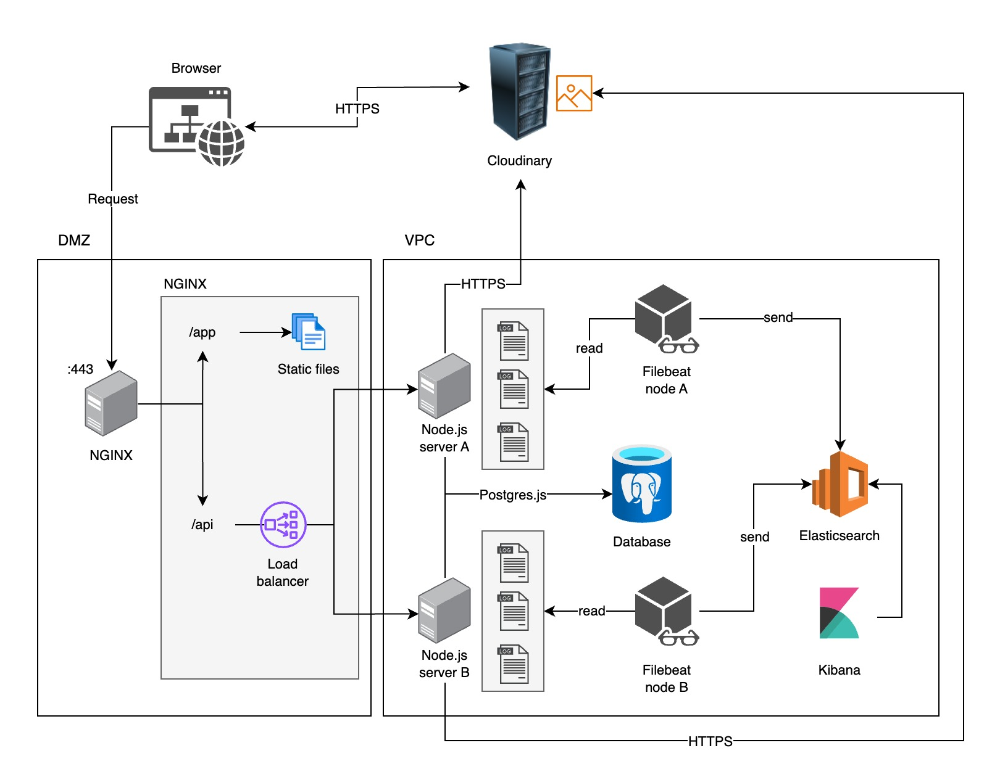

# SAFE

Sistema de Administración de Flotilla Empresarial (SAFE)

## Architecture diagram



## Requirements

- Latest version of [Bun](https://bun.sh/)
- Docker installed and running

## Setup

Create a `.env` file with the **exact same content** as `.env.example` and run the `start-database.sh` script.

The script will create a new database container and start it. You will be asked to generate a password for the database user, just type `Y` to generate a random password. The password will be stored in the `.env` file.

After running the script, a backup of the original `.env` file will be created, just in case you need to restore it. Don't forget to remove the backup file before committing your changes.

Finally, to setup the database schema, run the following command: `bun run db:push` while the database is running (You have to run this command every time you make a change to the database schema).

To install dependencies:

```bash
bun install
```

To run the development server:

```bash
bun run dev
```
